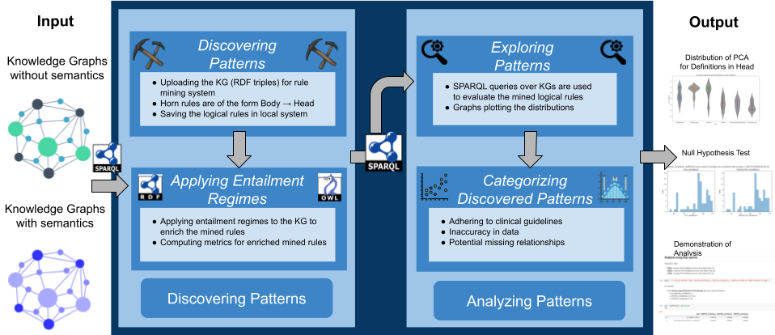

# Mining_Symbolic_Rules_ESWC2023_Demo

The goal of this research is to examine the mined logical rules from which true missing facts can be predicted, thereby completing KGs with accurate predictions that take KG ontologies and entailment regimes into account. Our framework is divided into 2 quadrants, in the first quadrant the rule mining system generates logical rules, by applying entailment regimes. A smaller subset of the EraMed project *‘P4-LUCAT’* is used for the experimental study. Due to privacy concerns, the P4-LUCAT knowledge graph cannot be made available as it contains data about lung cancer patients. Therefore, only the mined logical rules over P4-LUCAT KG will be made available publically in this repository under *'Rules'* folder.

For the experiments in the current example, we use **rdfs:subPropertyOf** to clearly demonstrate the impact of injecting entailment regimes in mining logical rules. The addition of entailment regimes increases metric values and potential true predictions. Inferred PCA has increased. For example, rule confidence quantifies the KG's partial completion by identifying more productive rules.

The null hypothesis test was used to ensure statistical independence between the PCA Confidence and Inferred PCA Confidence metrics, as shown in the results. When semantics are considered, the variation in the frequency distribution of metrics indicates that KGs may be completed with true predictions.

*SPARQL queries* are used in the second quadrant of the architecture to investigate KGs in order to demonstrate use cases of clinical guidelines violations, identify data errors, and potential missing relationships in the KGs. Exploration of mined logical rules through statistical analysis of the distribution of PCA Confidence score for definitions of predicates appearing in the Head of the mined logical rule. Several examples are provided in the jupyter notebook **'Mining Symbolic Rules To Explain Lung Cancer Treatments.ipynb'**, which is available in the repository. The **"Demonstration of Use Cases.pdf"** file contains a few examples of mined logical rules used to demonstrate use cases.
